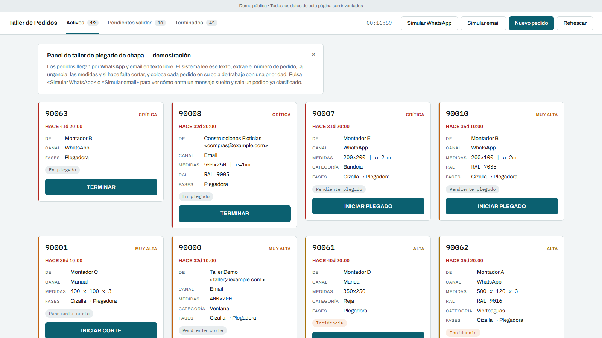
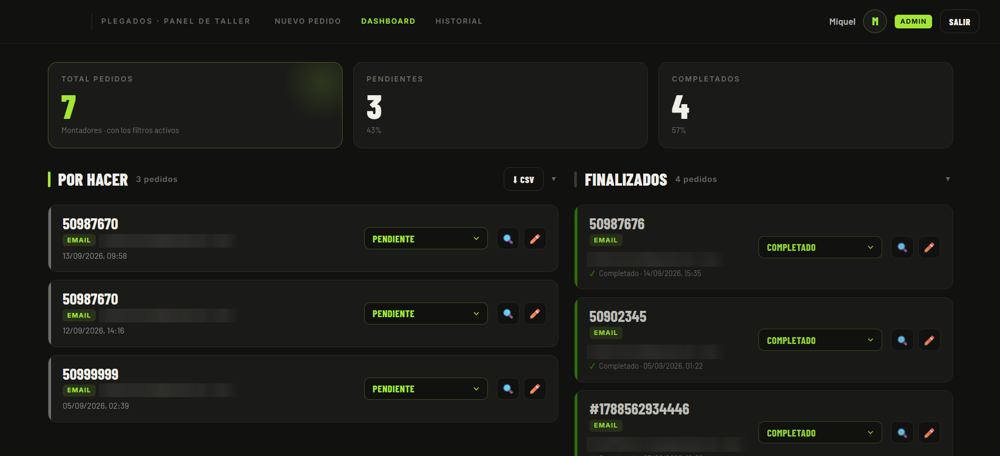
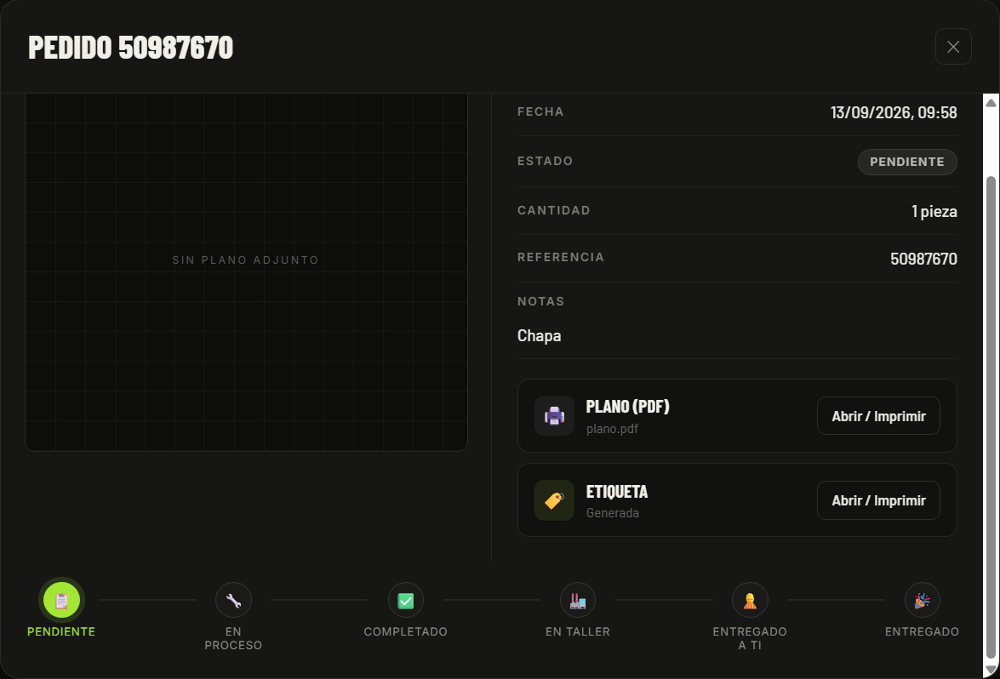
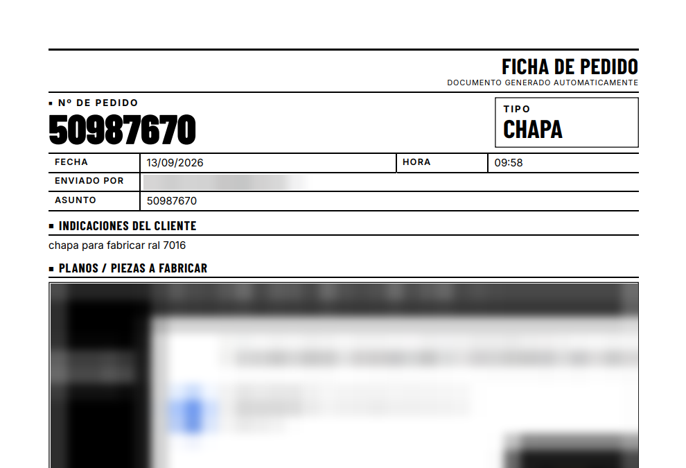
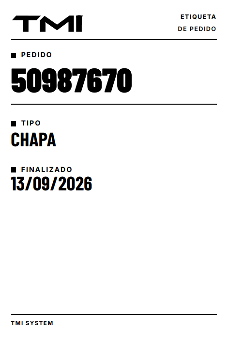

# TMI Order Management · Gestión de pedidos del taller

Panel de gestión de pedidos para un taller de plegado de chapa de aluminio. Convierte los pedidos que llegan en texto libre (WhatsApp, email) en colas de trabajo con prioridad.

**Demo en vivo:** [demo-taller.tmisystem.com](https://demo-taller.tmisystem.com)



**La demo usa datos completamente ficticios.** No está desplegada en ningún
cliente ni contiene datos reales de nadie.

Stack de la demo: **Node.js + Express + SQLite** (backend) y un **panel HTML/CSS/JS
sin build** (frontend), servido por el mismo proceso. Sin framework de frontend,
sin bundler, sin dependencias de servicios externos.

## En producción: panel de taller de TMI

La versión real de este sistema funciona cada día en TMI. Recoge en un mismo panel los pedidos que entran desde la oficina, los que llegan por correo y los que dan de alta los montadores del cliente desde el móvil.

- Cada pedido que llega por correo genera automáticamente su **ficha de pedido en PDF**, con los datos del correo y los planos adjuntos, y una **etiqueta** para identificar la pieza en el taller.
- El pedido avanza por estados, de *Pendiente* a *Entregado*, y el panel se actualiza en tiempo real.
- Roles separados para montadores, administración y almacén.

Tecnología: HTML, CSS y JavaScript sin build, sobre PostgreSQL gestionado con almacenamiento de archivos y tiempo real. Desarrollado en TMI junto a mi socio.





<table><tr>
<td width="68%"></td>
<td width="32%"></td>
</tr></table>

<sub>Capturas de producción. Los correos y los planos del cliente aparecen difuminados.</sub>

---

## El problema que resuelve

En un taller pequeño (una cizalla, una plegadora), los pedidos llegan por
WhatsApp y por email en **texto libre**, sin formato:

> «Pedido 90234, lo necesito hoy. 400x200 e=2mm, 2 pliegues r=3mm. RAL 9016.»

No hay número de pedido normalizado, ni fecha de entrega estructurada, ni
prioridad. El operario decide qué plegar mirando un grupo de mensajes.

Este sistema **lee ese texto libre**, extrae los datos, asigna una prioridad y
coloca cada pedido en su cola de trabajo, en un panel pensado para una tablet
junto a la máquina.

Para verlo en marcha en la demo: pulsa **«Simular WhatsApp»** o **«Simular
email»** en el panel. Entra un mensaje de ejemplo y sale un pedido ya
clasificado.

---

## Recorrido de un pedido

1. **Entra un mensaje.** En la demo, desde el botón de simular (endpoint interno
   `POST /api/demo/simulate`) o desde el formulario de alta manual. El diseño
   contempla también webhooks de WhatsApp/email (ver *Seguridad*).
2. **El parser lo interpreta** (`services/parser.js`): normaliza el texto (quita
   tildes, minúsculas) y extrae con expresiones regulares y heurísticas en
   español el número de pedido, la urgencia y la fecha, las medidas, el radio o
   número de pliegues, la categoría de pieza, el código RAL y si requiere corte
   previo en cizalla.
3. **Se deriva la prioridad** de la urgencia detectada: hoy → crítica, mañana a
   primera hora → muy alta, mañana → alta, pasado mañana → media, sin fecha →
   pendiente de validar.
4. **Se decide el estado inicial** (`services/orders.js`): si falta información
   (número, fecha o dibujo) va a *pendiente de validar*; si requiere corte, a
   *pendiente de corte*; si no, directo a *pendiente de plegado*.
5. **Se escribe todo en una transacción**: el pedido, sus adjuntos, una copia
   íntegra del mensaje original y los eventos de trazabilidad. O entra todo, o
   nada.
6. **Aparece en el panel**, en su cola y con su color de prioridad. El operario
   lo hace avanzar con un único botón que muestra la siguiente acción (INICIAR
   CORTE, INICIAR PLEGADO, TERMINAR, …), validada contra la máquina de estados.

---

## Modelo de datos

SQLite, 7 tablas (`models/db.js`): `orders`, `attachments`, `inbound_messages`,
`order_events`, `clients`, `users`, `machines`, con índices sobre estado,
prioridad y fecha de vencimiento.

- **`orders`** guarda **`raw_text` siempre** (el mensaje original completo),
  además de los campos extraídos y las marcas de tiempo de cada fase.
- **`inbound_messages`** conserva el payload original por separado.
- **`order_events`** es un log append-only: `created`, `incomplete_flag`,
  `status_changed`, `priority_changed`, `fields_updated`, `attachment_added`,
  cada uno con actor y timestamp.
- **`is_demo`** marca los datos de demostración para poder borrarlos sin tocar
  nada más.

### Estados del pedido

```
Solo plegado:   pending_press_brake → in_press_brake → done → ready_for_pickup → delivered
Corte+plegado:  pending_shear → in_shear → sheared → pending_press_brake → in_press_brake → done → …
                (desde cualquier estado operativo se puede marcar 'incident')
```

Las transiciones válidas están centralizadas en un único objeto
(`STATUS_TRANSITIONS`); el servidor rechaza cualquier salto no permitido.

---

## Decisiones de diseño (con su coste)

- **Parser aislado tras un contrato estable.** Es una función pura: recibe texto
  y devuelve siempre la misma forma de objeto. *Por qué:* es el componente que
  más se equivoca y más va a cambiar; sustituir su implementación no toca rutas
  ni modelo de datos. *Coste:* una capa de indirección sobre ~200 líneas de
  expresiones regulares.
- **SQLite con driver síncrono** (`better-sqlite3`) en vez de un motor
  cliente-servidor. *Por qué:* el destino es una máquina en un taller, sin
  administración; es transaccional y elimina `async/await` de toda la capa de
  datos. *Coste:* sin concurrencia de escritura ni acceso remoto; migrar a
  PostgreSQL obliga a reescribir la capa de datos y volverla asíncrona.
- **Guardar el texto original íntegro.** *Por qué:* el parser falla por
  definición; si se descarta el original, el error es irreversible. Conservarlo
  lo hace reprocesable. *Coste:* se duplica el texto (pedido + mensaje).
- **Transiciones de estado en un único mapa.** *Por qué:* cambiar el flujo del
  taller es editar un objeto, no repartir condicionales por el código. *Coste:*
  ninguno relevante.
- **Marca `is_demo` en la propia tabla** en lugar de dos entornos. *Por qué:*
  permite datos de prueba y reales conviviendo, borrando solo los de prueba.
  *Coste:* hay que acordarse de filtrar por ese campo en cualquier analítica.

---

## Seguridad (en esta demo pública)

- **CORS cerrado al propio origen.** El panel es *same-origin*; no se permite
  ningún origen cruzado.
- **Webhooks desactivados por defecto** (`WEBHOOKS_ENABLED`). Están
  implementados (`routes/webhooks.js`) para mostrar el diseño de payload
  normalizado, pero no se montan en público: así no queda una escritura pública
  sin autenticar, ni la descarga de URLs arbitrarias del webhook. La entrada de
  mensajes en la demo es el endpoint interno del panel.
- **Sin sembrado ni borrado por HTTP.** La base se siembra al desplegar con
  `npm run seed`; no hay endpoint de reinicio ni de borrado masivo alcanzable
  desde fuera. `simulate` solo **añade** un pedido.

---

## AUTORÍA

El modelado del dominio, el vocabulario de taller, la máquina de estados y las
decisiones de alcance son aportación propia. La escritura del código se hizo
mediante desarrollo asistido por IA bajo especificación y revisión propias.

---

## Cómo levantarlo

Requisitos: Node.js 20 o superior. Ningún servicio externo.

```bash
cd backend
cp .env.example .env
npm install
npm run seed     # siembra 3 clientes, 6 usuarios y ~72 pedidos ficticios
npm start        # arranca el panel + la API
```

Abrir **http://localhost:4000**.

Tests del parser (sin dependencias externas):

```bash
node test-parser.js     # 36 aserciones
```

### Qué mirar primero (para una revisión rápida)

- `backend/src/services/parser.js` — extracción desde texto libre.
- `backend/src/services/orders.js` — máquina de estados y trazabilidad.
- `backend/src/models/db.js` — esquema completo.
- `backend/src/seeds/demo-generator.js` — generador determinista de la demo.
- `frontend/index.html` — panel completo en un solo fichero.

---

## Despliegue

Contenedor único (Node 20 + SQLite embebida). La base de datos y los adjuntos
viven en `/data`, que **debe montarse como volumen persistente**. Pensado para
un VPS con Coolify detrás de un proxy inverso con TLS; el puerto no se publica
directamente, lo enruta el proxy.

| Variable | Por defecto (imagen) | Para qué |
|---|---|---|
| `PORT` | `4000` | Puerto de escucha. |
| `DB_PATH` | `/data/taller.db` | Fichero SQLite (en el volumen). |
| `UPLOADS_DIR` | `/data/uploads` | Adjuntos generados (en el volumen). |
| `WEBHOOKS_ENABLED` | `0` | Déjalo en `0` (ver *Seguridad*). |

La imagen trae valores por defecto correctos; para un despliegue estándar no
hace falta definir ninguna variable a mano.

Al primer arranque, si la base está vacía, el contenedor la siembra solo; en
reinicios posteriores conserva el estado del volumen.

Procedimiento completo (DNS, Coolify, volumen, TLS, verificación) en
[`DEPLOY.md`](DEPLOY.md).

---

## Alcance y siguiente iteración

Hoy el MVP cubre el flujo completo de un taller de una máquina: ingesta de texto
libre, parsing y priorización, máquina de estados con trazabilidad, y panel de
operación. Es un MVP monomáquina, no una plataforma endurecida para alto volumen.

La siguiente iteración lo lleva a producción multiusuario: **idempotencia por
identificador de mensaje** (un reenvío del proveedor no crea un duplicado),
**reintentos con cola** ante fallos de un paso, y **autenticación en los
endpoints** con roles; sobre esa base entran también el control de concurrencia
por versión de fila y las migraciones de esquema versionadas.
